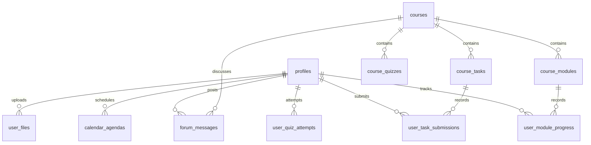

# Dokumentasi Migrasi Database ke Supabase: SekolahMu LMS

Dokumen ini berisi spesifikasi skema, relasi data, instruksi DDL SQL, konfigurasi keamanan (Row Level Security), dan struktur penyimpanan berkas yang diperlukan untuk bermigrasi dari mock database statis (`db.js` & `store.js`) ke **Supabase (PostgreSQL)**.

---

## 1. Entity Relationship Diagram (ERD)

Berikut adalah visualisasi hubungan antar tabel di database SekolahMu LMS:



---

## 2. Struktur Tabel & Skema SQL (DDL)

Jalankan skrip SQL DDL berikut di **SQL Editor** pada Supabase Dashboard Anda. Skrip ini mencakup pembuatan tipe enum, tabel, relasi kunci asing (Foreign Keys), indeks, serta pengisian nilai bawaan otomatis.

```sql
-- ==========================================
-- 1. EXTENSIONS & ENUM TYPES
-- ==========================================
CREATE EXTENSION IF NOT EXISTS "uuid-ossp";

CREATE TYPE edu_level_type AS ENUM ('sd', 'smk', 'kuliah');
CREATE TYPE agenda_type AS ENUM ('class', 'event', 'deadline');
CREATE TYPE file_category_type AS ENUM ('pdf', 'doc', 'code', 'archive');
CREATE TYPE course_status_type AS ENUM ('ongoing', 'completed');

-- ==========================================
-- 2. TABEL PROFIL PENGGUNA (profiles)
-- ==========================================
-- Tabel ini terhubung langsung dengan sistem autentikasi bawaan Supabase (auth.users)
CREATE TABLE public.profiles (
    id UUID REFERENCES auth.users(id) ON DELETE CASCADE PRIMARY KEY,
    username VARCHAR(100) NOT NULL,
    email VARCHAR(255),
    edu_level edu_level_type NOT NULL DEFAULT 'smk',
    is_admin BOOLEAN DEFAULT FALSE NOT NULL,
    avatar_url TEXT,
    updated_at TIMESTAMP WITH TIME ZONE DEFAULT TIMEZONE('utc'::text, NOW()) NOT NULL,
    created_at TIMESTAMP WITH TIME ZONE DEFAULT TIMEZONE('utc'::text, NOW()) NOT NULL
);

-- Mengaktifkan Row Level Security
ALTER TABLE public.profiles ENABLE ROW LEVEL SECURITY;

-- ==========================================
-- 3. TABEL MATA PELAJARAN / MATA KULIAH (courses)
-- ==========================================
CREATE TABLE public.courses (
    id SERIAL PRIMARY KEY,
    edu_level edu_level_type NOT NULL,
    title VARCHAR(150) NOT NULL,
    teacher VARCHAR(150) NOT NULL,
    description TEXT,
    color_class VARCHAR(100), -- Digunakan untuk class Tailwind gradien
    icon VARCHAR(50),        -- Nama ikon Lucide
    tag VARCHAR(50),         -- e.g., 'Kelas 4', 'Kelas XI', '3 SKS'
    is_active BOOLEAN DEFAULT TRUE NOT NULL, -- FALSE jika merupakan mata pelajaran riwayat/arsip
    period VARCHAR(50),      -- Digunakan untuk riwayat (e.g. 'Kelas 3', 'Semester 1')
    academic_year VARCHAR(20), -- Digunakan untuk riwayat (e.g. '2024/2025')
    final_score INTEGER,     -- Digunakan untuk riwayat (0 - 100)
    grade_letter VARCHAR(5),  -- Digunakan untuk riwayat (A, B, C, dst)
    created_at TIMESTAMP WITH TIME ZONE DEFAULT TIMEZONE('utc'::text, NOW()) NOT NULL
);

-- ==========================================
-- 4. TABEL MODUL MATA PELAJARAN (course_modules)
-- ==========================================
CREATE TABLE public.course_modules (
    id SERIAL PRIMARY KEY,
    course_id INTEGER REFERENCES public.courses(id) ON DELETE CASCADE NOT NULL,
    title VARCHAR(255) NOT NULL,
    duration VARCHAR(50), -- e.g., '15 menit', '1 jam'
    sequence_number INTEGER NOT NULL, -- Urutan tampil modul
    created_at TIMESTAMP WITH TIME ZONE DEFAULT TIMEZONE('utc'::text, NOW()) NOT NULL
);

-- ==========================================
-- 5. TABEL PROGRES MODUL USER (user_module_progress)
-- ==========================================
CREATE TABLE public.user_module_progress (
    id UUID DEFAULT uuid_generate_v4() PRIMARY KEY,
    user_id UUID REFERENCES public.profiles(id) ON DELETE CASCADE NOT NULL,
    module_id INTEGER REFERENCES public.course_modules(id) ON DELETE CASCADE NOT NULL,
    completed BOOLEAN DEFAULT FALSE NOT NULL,
    completed_at TIMESTAMP WITH TIME ZONE,
    UNIQUE(user_id, module_id)
);

-- ==========================================
-- 6. TABEL KUIS MATA PELAJARAN (course_quizzes)
-- ==========================================
CREATE TABLE public.course_quizzes (
    id SERIAL PRIMARY KEY,
    course_id INTEGER REFERENCES public.courses(id) ON DELETE CASCADE NOT NULL,
    question TEXT NOT NULL,
    options TEXT[] NOT NULL, -- Array berisi daftar pilihan jawaban
    correct_option_index INTEGER NOT NULL, -- Indeks jawaban benar (0-based)
    created_at TIMESTAMP WITH TIME ZONE DEFAULT TIMEZONE('utc'::text, NOW()) NOT NULL
);

-- ==========================================
-- 7. TABEL RIWAYAT PERCOBAAN KUIS USER (user_quiz_attempts)
-- ==========================================
CREATE TABLE public.user_quiz_attempts (
    id UUID DEFAULT uuid_generate_v4() PRIMARY KEY,
    user_id UUID REFERENCES public.profiles(id) ON DELETE CASCADE NOT NULL,
    course_id INTEGER REFERENCES public.courses(id) ON DELETE CASCADE NOT NULL,
    stars_earned INTEGER DEFAULT 0 NOT NULL, -- Bintang yang diraih (1-3 bintang)
    completed_at TIMESTAMP WITH TIME ZONE DEFAULT TIMEZONE('utc'::text, NOW()) NOT NULL,
    UNIQUE(user_id, course_id)
);

-- ==========================================
-- 8. TABEL TUGAS MATA PELAJARAN (course_tasks)
-- ==========================================
CREATE TABLE public.course_tasks (
    id SERIAL PRIMARY KEY,
    course_id INTEGER REFERENCES public.courses(id) ON DELETE CASCADE NOT NULL,
    title VARCHAR(255) NOT NULL,
    due_date TIMESTAMP WITH TIME ZONE, -- Waktu tenggat pengerjaan
    max_points INTEGER DEFAULT 100 NOT NULL,
    created_at TIMESTAMP WITH TIME ZONE DEFAULT TIMEZONE('utc'::text, NOW()) NOT NULL
);

-- ==========================================
-- 9. TABEL PENGUMPULAN TUGAS USER (user_task_submissions)
-- ==========================================
CREATE TABLE public.user_task_submissions (
    id UUID DEFAULT uuid_generate_v4() PRIMARY KEY,
    user_id UUID REFERENCES public.profiles(id) ON DELETE CASCADE NOT NULL,
    task_id INTEGER REFERENCES public.course_tasks(id) ON DELETE CASCADE NOT NULL,
    completed BOOLEAN DEFAULT FALSE NOT NULL,
    points_earned INTEGER,
    submitted_at TIMESTAMP WITH TIME ZONE,
    UNIQUE(user_id, task_id)
);

-- ==========================================
-- 10. TABEL FORUM DISKUSI PER KELAS (forum_messages)
-- ==========================================
CREATE TABLE public.forum_messages (
    id UUID DEFAULT uuid_generate_v4() PRIMARY KEY,
    course_id INTEGER REFERENCES public.courses(id) ON DELETE CASCADE NOT NULL,
    user_id UUID REFERENCES public.profiles(id) ON DELETE SET NULL,
    sender_name VARCHAR(100) NOT NULL,
    sender_role VARCHAR(50) NOT NULL, -- e.g., 'Pengajar', 'Mahasiswa', 'Siswa'
    message_text TEXT NOT NULL,
    created_at TIMESTAMP WITH TIME ZONE DEFAULT TIMEZONE('utc'::text, NOW()) NOT NULL
);

-- ==========================================
-- 11. TABEL KALENDER & AGENDA (calendar_agendas)
-- ==========================================
CREATE TABLE public.calendar_agendas (
    id UUID DEFAULT uuid_generate_v4() PRIMARY KEY,
    user_id UUID REFERENCES public.profiles(id) ON DELETE CASCADE, -- NULL jika agenda global dari sistem/akademik
    edu_level edu_level_type NOT NULL,
    date DATE NOT NULL,
    title VARCHAR(255) NOT NULL,
    type agenda_type NOT NULL DEFAULT 'class',
    created_at TIMESTAMP WITH TIME ZONE DEFAULT TIMEZONE('utc'::text, NOW()) NOT NULL
);

-- ==========================================
-- 12. TABEL METADATA PENYIMPANAN BERKAS (user_files)
-- ==========================================
CREATE TABLE public.user_files (
    id UUID DEFAULT uuid_generate_v4() PRIMARY KEY,
    user_id UUID REFERENCES public.profiles(id) ON DELETE CASCADE NOT NULL,
    edu_level edu_level_type NOT NULL,
    name VARCHAR(255) NOT NULL,
    size_str VARCHAR(30) NOT NULL,  -- e.g., '1.2 MB', '850 KB'
    bytes_size INTEGER NOT NULL,    -- Ukuran dalam byte untuk kalkulasi kapasitas penyimpanan
    file_type file_category_type NOT NULL,
    folder_name VARCHAR(100),       -- e.g., 'Projek-Web', 'Draf-Skripsi'
    storage_path TEXT NOT NULL,     -- Path lokasi file pada Supabase Storage Bucket
    created_at TIMESTAMP WITH TIME ZONE DEFAULT TIMEZONE('utc'::text, NOW()) NOT NULL
);
```

---

## 3. Skema Keamanan: Row Level Security (RLS)

Guna memastikan keamanan data di Supabase, jalankan kebijakan-kebijakan keamanan berikut pada database Anda:

```sql
-- Mengaktifkan RLS pada tabel-tabel utama
ALTER TABLE public.courses ENABLE ROW LEVEL SECURITY;
ALTER TABLE public.course_modules ENABLE ROW LEVEL SECURITY;
ALTER TABLE public.course_quizzes ENABLE ROW LEVEL SECURITY;
ALTER TABLE public.course_tasks ENABLE ROW LEVEL SECURITY;
ALTER TABLE public.user_module_progress ENABLE ROW LEVEL SECURITY;
ALTER TABLE public.user_quiz_attempts ENABLE ROW LEVEL SECURITY;
ALTER TABLE public.user_task_submissions ENABLE ROW LEVEL SECURITY;
ALTER TABLE public.forum_messages ENABLE ROW LEVEL SECURITY;
ALTER TABLE public.calendar_agendas ENABLE ROW LEVEL SECURITY;
ALTER TABLE public.user_files ENABLE ROW LEVEL SECURITY;

-- ==========================================
-- KEBIJAKAN UNTUK MEMBACA DATA AKADEMIK UMUM
-- ==========================================
-- Siapapun pengguna terautentikasi dapat melihat daftar mata pelajaran, modul, kuis, dan tugas
CREATE POLICY "Allow read access for authenticated users on courses" 
ON public.courses FOR SELECT TO authenticated USING (true);

CREATE POLICY "Allow read access for authenticated users on modules" 
ON public.course_modules FOR SELECT TO authenticated USING (true);

CREATE POLICY "Allow read access for authenticated users on quizzes" 
ON public.course_quizzes FOR SELECT TO authenticated USING (true);

CREATE POLICY "Allow read access for authenticated users on tasks" 
ON public.course_tasks FOR SELECT TO authenticated USING (true);

-- ==========================================
-- KEBIJAKAN DATA PRIBADI USER (HANYA PEMILIK DATA)
-- ==========================================

-- Profil Pengguna
CREATE POLICY "Allow read for authenticated users on profiles" 
ON public.profiles FOR SELECT TO authenticated USING (true);

CREATE POLICY "Allow update for owners and admins on profiles" 
ON public.profiles FOR UPDATE TO authenticated 
USING (auth.uid() = id OR public.is_admin())
WITH CHECK (auth.uid() = id OR public.is_admin());

-- Progres Modul
CREATE POLICY "Manage own module progress" 
ON public.user_module_progress FOR ALL TO authenticated 
USING (auth.uid() = user_id) WITH CHECK (auth.uid() = user_id);

-- Percobaan Kuis
CREATE POLICY "Manage own quiz attempts" 
ON public.user_quiz_attempts FOR ALL TO authenticated 
USING (auth.uid() = user_id) WITH CHECK (auth.uid() = user_id);

-- Pengumpulan Tugas
CREATE POLICY "Manage own task submissions" 
ON public.user_task_submissions FOR ALL TO authenticated 
USING (auth.uid() = user_id) WITH CHECK (auth.uid() = user_id);

-- File Pribadi
CREATE POLICY "Manage own files" 
ON public.user_files FOR ALL TO authenticated 
USING (auth.uid() = user_id) WITH CHECK (auth.uid() = user_id);

-- ==========================================
-- KEBIJAKAN KELOMPOK / DATA BERSAMA
-- ==========================================

-- Forum Diskusi (Pengguna bisa membaca semua pesan, tapi hanya bisa menulis pesan atas namanya sendiri)
CREATE POLICY "Allow select for authenticated users on forum_messages" 
ON public.forum_messages FOR SELECT TO authenticated USING (true);

CREATE POLICY "Allow insert for creators on forum_messages" 
ON public.forum_messages FOR INSERT TO authenticated WITH CHECK (auth.uid() = user_id);

-- Kalender Agenda (Dapat membaca agenda milik sendiri atau agenda sistem tanpa user_id)
CREATE POLICY "Allow select for owned or system agendas" 
ON public.calendar_agendas FOR SELECT TO authenticated 
USING (user_id IS NULL OR auth.uid() = user_id);

CREATE POLICY "Allow insert/update/delete for own agendas" 
ON public.calendar_agendas FOR ALL TO authenticated 
USING (auth.uid() = user_id) WITH CHECK (auth.uid() = user_id);
```

---

## 4. Struktur Penyimpanan File (Supabase Storage)

Untuk fitur upload berkas pribadi di halaman **File Saya / Drive**, Anda harus membuat bucket penyimpanan khusus:

1. Pergi ke menu **Storage** di dashboard Supabase Anda.
2. Buat bucket baru dengan nama: **`user-documents`**.
3. Pastikan status bucket adalah **Private** (untuk melindungi privasi mahasiswa/siswa).
4. Tambahkan kebijakan akses penyimpanan berikut melalui tab **Policies**:
   - **Membaca Berkas Anda Sendiri**:
     ```sql
     (role() = 'authenticated'::text) AND (auth.uid()::text = (storage.foldername(name))[1])
     ```
   - **Mengunggah & Menghapus Berkas Anda Sendiri**:
     ```sql
     (role() = 'authenticated'::text) AND (auth.uid()::text = (storage.foldername(name))[1])
     ```

*Catatan: Saat frontend mengunggah berkas, berkas tersebut harus disimpan dengan format path `${auth.uid()}/${edu_level}/${filename}` pada bucket `user-documents`.*

---

## 5. Sinkronisasi Data Statis (Seed Data SQL)

Gunakan skrip seed berikut untuk mengisi database Anda dengan data pelajaran statis bawaan yang saat ini ada di `db.js`. Ini akan mempercepat pengujian antarmuka frontend Anda.

```sql
-- ==========================================
-- SEED DATA: COURSES
-- ==========================================
INSERT INTO public.courses (id, edu_level, title, teacher, description, color_class, icon, tag, is_active) VALUES
-- SD Active Courses
(1, 'sd', 'Matematika Ceria', 'Bu Endang Sri', 'Belajar matematika dasar dengan cara yang asyik...', 'from-sky-400 to-blue-500', 'smile', 'Kelas 4', true),
(2, 'sd', 'Bahasa Indonesia', 'Pak Joko Susilo', 'Membaca dongeng, menulis karangan, dan berbicara sopan...', 'from-emerald-400 to-teal-500', 'book-open', 'Kelas 4', true),
(3, 'sd', 'Menggambar & Mewarnai', 'Bu Maria Utama', 'Ekspresikan kreativitas tanpa batas! Pelajari dasar teori warna...', 'from-purple-400 to-pink-500', 'palette', 'Kelas 4', true),
(4, 'sd', 'Pendidikan Pancasila', 'Pak Budi Hartono', 'Mengenal lambang negara Garuda Pancasila, gotong royong...', 'from-rose-400 to-red-500', 'award', 'Kelas 4', true),

-- SMK Active Courses
(5, 'smk', 'Pemrograman Basis Data', 'Pak Budi Santoso', 'Materi kejuruan RPL berfokus pada perancangan basis data...', 'from-indigo-500 to-purple-600', 'database', 'Kelas XI', true),
(6, 'smk', 'Front End Web Development', 'Bu Rina Wijaya', 'Membangun antarmuka web modern yang responsif...', 'from-emerald-400 to-teal-500', 'layout', 'Kelas XI', true),
(7, 'smk', 'Pemrograman Berorientasi Objek', 'Pak Andi Pratama', 'Menguasai paradigma Object-Oriented Programming Java...', 'from-blue-500 to-cyan-500', 'code', 'Kelas XI', true),
(8, 'smk', 'Pemrograman Perangkat Bergerak', 'Bu Siti Aminah', 'Pengembangan aplikasi mobile lintas platform dengan Flutter...', 'from-rose-400 to-orange-500', 'smartphone', 'Kelas XI', true),

-- Kuliah Active Courses
(9, 'kuliah', 'Rekayasa Perangkat Lunak', 'Dr. Ir. Wahyu Wibowo', 'Mata kuliah wajib metodologi pengembangan sistem skala besar...', 'from-indigo-600 to-violet-800', 'cpu', '3 SKS', true),
(10, 'kuliah', 'Desain Basis Data Lanjut', 'Prof. Budi Rahardjo', 'Eksplorasi mendalam perancangan enterprise database...', 'from-indigo-400 to-cyan-600', 'database', '4 SKS', true),
(11, 'kuliah', 'Analisis Algoritma', 'Dr. Rina Wijaya', 'Studi matematis dan praktis mengenai performa komputasi...', 'from-slate-700 to-slate-900', 'terminal', '3 SKS', true),
(12, 'kuliah', 'Pemrograman Web Enterprise', 'Ir. Hermawan, M.T.', 'Membangun aplikasi web skala korporat dengan modular Spring Boot...', 'from-blue-600 to-indigo-800', 'globe', '4 SKS', true);

-- ==========================================
-- SEED DATA: COURSE MODULES
-- ==========================================
INSERT INTO public.course_modules (course_id, title, duration, sequence_number) VALUES
-- Matematika Ceria (ID 1)
(1, 'Modul 1: Penjumlahan Ceria 1 sampai 100', '15 menit', 1),
(1, 'Modul 2: Berpetualang dengan Pengurangan', '20 menit', 2),
(1, 'Modul 3: Perkalian Asyik Menggunakan Gambar', '25 menit', 3),
(1, 'Modul 4: Pengenalan Pembagian dengan Pembagian Kue 🍰', '30 menit', 4),

-- Pemrograman Basis Data (ID 5)
(5, 'Modul 1: Pengantar Relational Database Management System (RDBMS)', '45 menit', 1),
(5, 'Modul 2: Skema Normalisasi Database 1NF, 2NF, 3NF', '60 menit', 2),
(5, 'Modul 3: Sintaks SQL DDL (CREATE, ALTER, DROP)', '50 menit', 3),
(5, 'Modul 4: Query DML Kompleks (JOIN, GROUP BY, HAVING)', '90 menit', 4),

-- Rekayasa Perangkat Lunak (ID 9)
(9, 'Modul 1: Pengenalan SDLC & Pemilihan Model Proses Perangkat Lunak', '60 menit', 1),
(9, 'Modul 2: Analisis Kebutuhan Sistem (Software Requirements Specification - SRS)', '90 menit', 2),
(9, 'Modul 3: Desain Arsitektur & Pemodelan Berorientasi Objek dengan UML', '90 menit', 3),
(9, 'Modul 4: Verifikasi & Validasi Perangkat Lunak (QA/QC Testing)', '75 menit', 4);

-- ==========================================
-- SEED DATA: COURSE QUIZZES
-- ==========================================
INSERT INTO public.course_quizzes (course_id, question, options, correct_option_index) VALUES
(1, 'Berapakah hasil dari 25 + 17?', ARRAY['32', '42', '45', '52'], 1),
(1, 'Jika Budi punya 10 apel dan memberikan 4 apel ke Siti, sisa apel Budi adalah...', ARRAY['4', '5', '6', '7'], 2),
(2, 'Dongeng Malin Kundang mengajarkan kita untuk...', ARRAY['Rajin belajar', 'Sopan kepada guru', 'Berdagang ke luar negeri', 'Sabar & Berbakti kepada orang tua'], 3);

-- ==========================================
-- SEED DATA: COURSE TASKS
-- ==========================================
INSERT INTO public.course_tasks (id, course_id, title, due_date, max_points) VALUES
(1, 5, 'Tugas Skema Database Toko Online', '2026-05-21 23:59:00+07', 100),
(2, 6, 'Landing Page Interaktif (Vue.js)', '2026-05-22 23:59:00+07', 100),
(3, 9, 'Laporan Bab 3 - Dokumen SRS Lengkap', '2026-05-21 23:59:00+07', 100),
(4, 10, 'Tugas Praktikum Pewarisan Database', '2026-05-22 23:59:00+07', 100);

-- ==========================================
-- SEED DATA: ACADEMIC CALENDAR (GLOBAL)
-- ==========================================
INSERT INTO public.calendar_agendas (edu_level, date, title, type) VALUES
('sd', '2026-05-05', 'Belajar Menggambar di Kelas', 'class'),
('sd', '2026-05-12', 'Dongeng Bersama Pak Joko', 'event'),
('sd', '2026-05-21', 'Tenggat: Menggambar Rumah Impian', 'deadline'),
('smk', '2026-05-08', 'Ujian Praktik Java OOP', 'event'),
('smk', '2026-05-15', 'Webinar Sukses Karir Developer RPL', 'event'),
('smk', '2026-05-21', 'Tenggat: Skema Database Toko Online', 'deadline'),
('kuliah', '2026-05-10', 'Kuliah Tamu: Microservices Architecture di Tokopedia', 'event'),
('kuliah', '2026-05-21', 'Tenggat: Laporan Bab 3 - Dokumen SRS Lengkap', 'deadline');
```

---

## 6. Contoh Integrasi Frontend (Supabase JS Client)

Gunakan cuplikan JavaScript di bawah ini untuk mengambil data secara dinamis dari Supabase di aplikasi Anda setelah Anda menginstal `@supabase/supabase-js`.

### Inisialisasi Supabase Client
```javascript
import { createClient } from '@supabase/supabase-js';

const supabaseUrl = import.meta.env.VITE_SUPABASE_URL;
const supabaseAnonKey = import.meta.env.VITE_SUPABASE_ANON_KEY;

export const supabase = createClient(supabaseUrl, supabaseAnonKey);
```

### 1. Mengambil Daftar Mata Pelajaran Aktif (Sesuai Jenjang)
```javascript
async function fetchCourses(eduLevel) {
  const { data, error } = await supabase
    .from('courses')
    .select(`
      id,
      title,
      teacher,
      description,
      color_class,
      icon,
      tag,
      course_modules (id, title, duration, sequence_number)
    `)
    .eq('edu_level', eduLevel)
    .eq('is_active', true);

  if (error) {
    console.error('Error fetching courses:', error);
    return [];
  }
  return data;
}
```

### 2. Mengambil Pesan Forum Diskusi Kelas
```javascript
async function fetchForumMessages(courseId) {
  const { data, error } = await supabase
    .from('forum_messages')
    .select('*')
    .eq('course_id', courseId)
    .order('created_at', { ascending: true });

  if (error) {
    console.error('Error fetching forum messages:', error);
    return [];
  }
  return data;
}
```

### 3. Mengunggah File Baru Ke Storage & Menyimpan Metadata ke Database
```javascript
async function uploadUserFile(file, eduLevel, folderName) {
  // 1. Dapatkan user ID aktif
  const { data: { user } } = await supabase.auth.getUser();
  if (!user) throw new Error('Pengguna tidak terautentikasi.');

  const storagePath = `${user.id}/${eduLevel}/${Date.now()}_${file.name}`;

  // 2. Upload file ke Supabase Storage Bucket
  const { data: uploadData, error: uploadError } = await supabase.storage
    .from('user-documents')
    .upload(storagePath, file);

  if (uploadError) throw uploadError;

  // 3. Simpan metadata ke tabel user_files
  const { data: dbData, error: dbError } = await supabase
    .from('user_files')
    .insert([{
      user_id: user.id,
      edu_level: eduLevel,
      name: file.name,
      size_str: `${(file.size / 1024).toFixed(1)} KB`,
      bytes_size: file.size,
      file_type: getFileCategory(file.name),
      folder_name: folderName,
      storage_path: storagePath
    }]);

  if (dbError) throw dbError;
  return dbData;
}
```

---

## 6. Migrasi Struktur Admin & Peran (Admin Panel)

Jalankan skrip SQL berikut di editor query database Supabase Anda untuk mempersiapkan tabel, relasi, trigger keamanan, dan hak akses Admin Panel:

```sql
-- 1. Tambahkan kolom email dan is_admin ke tabel profiles jika belum ada
ALTER TABLE public.profiles ADD COLUMN IF NOT EXISTS email VARCHAR(255);
ALTER TABLE public.profiles ADD COLUMN IF NOT EXISTS is_admin BOOLEAN DEFAULT FALSE;

-- 2. Buat fungsi helper untuk memeriksa apakah user adalah admin (menghindari infinite recursion di RLS)
CREATE OR REPLACE FUNCTION public.is_admin()
RETURNS BOOLEAN SECURITY DEFINER SET search_path = public AS $$
BEGIN
  RETURN EXISTS (
    SELECT 1 FROM public.profiles
    WHERE id = auth.uid() AND is_admin = true
  );
END;
$$ LANGUAGE plpgsql;

-- 3. Perbarui fungsi trigger handle_new_user agar merekam email dan menyetel user pertama sebagai admin secara opsional
CREATE OR REPLACE FUNCTION public.handle_new_user()
RETURNS TRIGGER AS $$
DECLARE
  clean_username VARCHAR(100);
  detected_level public.edu_level_type;
  is_first_user BOOLEAN;
BEGIN
  -- 1. Bersihkan email untuk format username yang ramah
  clean_username := INITCAP(REGEXP_REPLACE(SPLIT_PART(NEW.email, '@', 1), '[\._-]', ' ', 'g'));
  
  -- 2. Deteksi level pendidikan berdasarkan domain email
  IF NEW.email ILIKE '%sd.%' THEN
    detected_level := 'sd'::public.edu_level_type;
  ELSIF NEW.email ILIKE '%kuliah.%' OR NEW.email ILIKE '%univ.%' OR NEW.email ILIKE '%ac.id' THEN
    detected_level := 'kuliah'::public.edu_level_type;
  ELSE
    detected_level := 'smk'::public.edu_level_type;
  END IF;

  -- 3. Cek apakah ini user pertama di tabel profiles
  SELECT NOT EXISTS (SELECT 1 FROM public.profiles) INTO is_first_user;

  -- 4. Masukkan ke tabel profiles
  INSERT INTO public.profiles (id, username, edu_level, email, is_admin, avatar_url)
  VALUES (
    NEW.id,
    clean_username,
    detected_level,
    NEW.email,
    is_first_user, -- Set user pertama sebagai admin secara otomatis untuk mempermudah testing
    COALESCE(NEW.raw_user_meta_data->>'avatar_url', NULL)
  );
  
  RETURN NEW;
END;
$$ LANGUAGE plpgsql SECURITY DEFINER SET search_path = public;

-- 4. Perbarui kebijakan RLS pada tabel profiles untuk izin UPDATE dan SELECT
DROP POLICY IF EXISTS "Allow update for owners on profiles" ON public.profiles;
DROP POLICY IF EXISTS "Allow update for owners and admins on profiles" ON public.profiles;
DROP POLICY IF EXISTS "Allow read for authenticated users on profiles" ON public.profiles;

-- Kebijakan SELECT: Semua user terautentikasi bisa membaca profile
CREATE POLICY "Allow read for authenticated users on profiles"
ON public.profiles FOR SELECT
TO authenticated
USING (true);

-- Kebijakan UPDATE: Pemilik profile ATAU admin bisa memperbarui profile
CREATE POLICY "Allow update for owners and admins on profiles"
ON public.profiles FOR UPDATE
TO authenticated
USING (auth.uid() = id OR public.is_admin())
WITH CHECK (auth.uid() = id OR public.is_admin());

-- 5. Buat trigger sebelum update untuk mencegah eskalasi hak akses (hanya admin yang bisa mengubah kolom is_admin)
CREATE OR REPLACE FUNCTION public.check_profile_update()
RETURNS TRIGGER AS $$
BEGIN
  -- Blokir perubahan is_admin HANYA jika dipicu oleh client-side auth session yang bukan admin (auth.uid() is not null)
  IF auth.uid() IS NOT NULL AND NEW.is_admin IS DISTINCT FROM OLD.is_admin AND NOT public.is_admin() THEN
    NEW.is_admin := OLD.is_admin;
  END IF;
  RETURN NEW;
END;
$$ LANGUAGE plpgsql SECURITY DEFINER SET search_path = public;

DROP TRIGGER IF EXISTS trigger_check_profile_update ON public.profiles;
CREATE TRIGGER trigger_check_profile_update
BEFORE UPDATE ON public.profiles
FOR EACH ROW
EXECUTE FUNCTION public.check_profile_update();

-- 6. Hubungkan auth.users ke public.profiles menggunakan Trigger (PENTING: ini harus dipasang agar profile otomatis terbuat saat signup)
DROP TRIGGER IF EXISTS on_auth_user_created ON auth.users;
CREATE TRIGGER on_auth_user_created
AFTER INSERT ON auth.users
FOR EACH ROW
EXECUTE FUNCTION public.handle_new_user();

-- 7. Salin data user lama yang sudah ada di auth.users ke public.profiles (agar tidak perlu sign up ulang)
INSERT INTO public.profiles (id, username, email, edu_level, is_admin)
SELECT 
  id, 
  INITCAP(REGEXP_REPLACE(SPLIT_PART(email, '@', 1), '[\._-]', ' ', 'g')) as username,
  email,
  'smk'::public.edu_level_type as edu_level,
  CASE WHEN email = 'keane.arazaan@gmail.com' THEN true ELSE false END as is_admin
FROM auth.users
ON CONFLICT (id) DO NOTHING;
```
